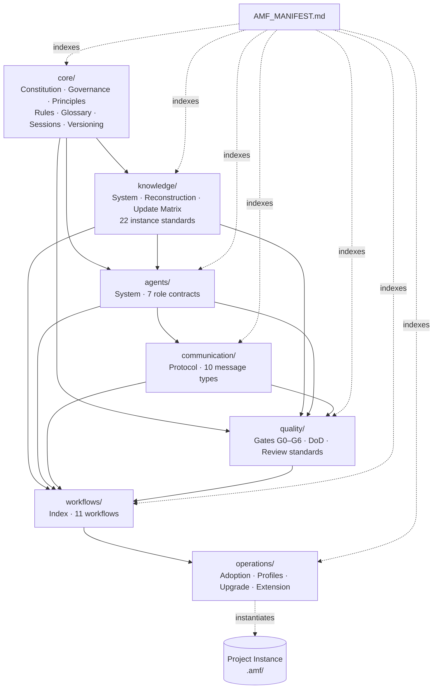

# AMF — Framework Architecture Specification

| Field            | Value                                              |
|------------------|----------------------------------------------------|
| Document         | AMF_ARCHITECTURE.md                                |
| Framework        | AI Multi-Agent Framework (AMF)                     |
| Version          | 1.0.0                                              |
| Status           | ACTIVE — approved by Human Owner on 2026-07-12; frozen per §19 |
| Phase            | Phase 0 — Architecture & Design                    |
| Authority        | Architecture authority. Subordinate only to the Human Owner. Once approved, all later phases implement this specification and may refine it only through the amendment process defined in §14. |
| Owner            | Human Owner (Giulio)                               |
| Author role      | Lead Framework Architect                           |
| Consumers        | All future implementation phases (1–8)             |
| Supersedes       | —                                                  |

---

## Table of Contents

1. [Executive Summary](#1-executive-summary)
2. [Problem Analysis & Challenged Assumptions](#2-problem-analysis--challenged-assumptions)
3. [Architectural Decisions](#3-architectural-decisions)
4. [The AMF Model](#4-the-amf-model)
5. [Module Architecture](#5-module-architecture)
6. [Directory Structure](#6-directory-structure)
7. [Complete Document Inventory](#7-complete-document-inventory)
8. [Dependency Graph](#8-dependency-graph)
9. [Agent System Architecture](#9-agent-system-architecture)
10. [Operational Flows](#10-operational-flows)
11. [Knowledge & Context Strategy](#11-knowledge--context-strategy)
12. [Quality Architecture](#12-quality-architecture)
13. [Versioning & Compatibility Strategy](#13-versioning--compatibility-strategy)
14. [Extensibility & Future Compatibility](#14-extensibility--future-compatibility)
15. [Writing Order](#15-writing-order)
16. [Implementation Roadmap](#16-implementation-roadmap)
17. [Improvements Over the Initial Concept](#17-improvements-over-the-initial-concept)
18. [Risks & Delegated Decisions](#18-risks--delegated-decisions)
19. [Approval](#19-approval)

---

## 1. Executive Summary

AMF is an engineering operating system for AI-driven software development. It turns a single AI coding agent into a structured engineering organization: specialized roles with explicit authority, a persistent knowledge system that survives session boundaries, standardized communication, enforced quality gates, and versioned governance.

This specification defines the complete architecture of AMF v1.0:

- **Two artifacts, strictly separated**: the **Framework** (this repository — rules, roles, workflows, standards; read-only during project work) and the **Instance** (a `.amf/` directory inside each software project — that project's living memory, created from framework templates).
- **Seven modules** organized in dependency layers: `core`, `knowledge`, `agents`, `communication`, `quality`, `workflows`, `operations`, plus a root **Manifest** that is the single entry point.
- **Seven agent roles** (Orchestrator, Product Analyst, Architect, Engineer, Reviewer, QA Engineer, Release Manager) defined as *roles*, not processes — executable by one AI instance switching roles or by parallel subagents.
- **Three decision classes** (D1 local, D2 structural, D3 strategic) replacing a flat approval chain.
- **Three adoption profiles** (Minimal, Standard, Full) so documentation overhead scales with project size.
- **Tiered context reading** so a session reconstructs project state within a finite context budget instead of "read everything".
- **66 normative framework documents** (68 files including README and this specification), fully inventoried in §7 and written across 8 implementation phases (§16).

The architecture deliberately optimizes for the two failure modes that kill frameworks like this in practice: **documentation overhead that exceeds its value** (solved by profiles and single-responsibility documents) and **context loss between AI sessions** (solved by the knowledge system, session ledger, and mandatory handover).

---

## 2. Problem Analysis & Challenged Assumptions

### 2.1 What problem AMF actually solves

An AI coding agent working on a long-running project fails in predictable ways:

| # | Failure mode | Root cause |
|---|--------------|-----------|
| F1 | Re-litigates decisions already made | No durable decision record with rationale |
| F2 | Loses project state between sessions | No structured handover; memory ends with the context window |
| F3 | Produces inconsistent architecture over time | No single owner of architectural authority |
| F4 | Mixes planning, implementation and review into one undifferentiated stream | No role separation, no separation of duties |
| F5 | Documentation drifts from reality | No update triggers tied to events; no ownership |
| F6 | Quality varies with prompt phrasing | No objective gates; quality is re-negotiated every session |
| F7 | Small projects drown in process | One-size-fits-all methodology |

Every module in AMF exists to close one or more of these failure modes. A module that closes none of them does not belong in the framework. This traceability is maintained in §5 (each module names the failure modes it addresses).

### 2.2 Assumptions challenged

The initial concept (Phase 0 brief) was sound but left five assumptions unexamined. Each was challenged; the resolutions became architectural decisions in §3.

**A1 — "The framework is a set of documents the AI reads."**
Challenged. A framework the AI must *fully* read every session is unusable: context windows are finite and expensive. Resolution: the framework defines **reading tiers and per-workflow reading lists**; no session ever reads the whole framework (→ AD-3).

**A2 — "Agents are the unit of the system."**
Challenged. In today's runtimes (Claude Code and peers), "agents" may be one model instance switching roles, or genuinely parallel subagents. If AMF hard-codes parallel agents, it breaks on single-instance runtimes; if it hard-codes a single instance, it cannot scale up. Resolution: AMF defines **roles with contracts**; the execution topology is a runtime concern (→ AD-4).

**A3 — "One framework fits every project."**
Challenged. A single-file restaurant website and a multi-tenant SaaS do not deserve the same documentation surface. Applying the full system to a small project violates the framework's own principle that every component must solve a real problem. Resolution: **adoption profiles** (→ AD-2).

**A4 — "Framework and project documentation live together."**
The brief implied one body of documents. Challenged: framework rules are reusable and versioned; project knowledge is per-project and living. Mixing them means every project forks the framework and upgrades become impossible. Resolution: **framework/instance separation** (→ AD-1).

**A5 — "~15 module categories (Core, Governance, Knowledge, Agents, Communication, Workflows, Quality, Architecture, Templates, Prompts, Operations, Lifecycle, Reference, Utilities, Documentation)."**
Challenged. Several proposed categories have no independent responsibility: *Governance* is constitutionally part of Core; *Prompts* are exactly the agent role definitions; *Templates* have no semantics of their own — each belongs to the module that owns its meaning; *Architecture* (how to document a system's architecture) is a knowledge concern; *Lifecycle* is Operations; *Reference/Utilities/Documentation* are navigation, which is the Manifest's job. Fifteen categories with overlapping ownership is precisely the coupling the brief forbids. Resolution: **seven modules with disjoint responsibilities** (→ AD-6).

### 2.3 Constraints accepted as ground truth

- AI sessions are finite and stateless between runs. Persistent memory must live in files.
- The framework must be technology-agnostic (websites, SaaS, tools, APIs, automation) and runtime-portable (Claude Code today, others tomorrow).
- Humans are in the loop but must not be required for routine progress. The Human Owner is an authority of last resort and of strategic decisions, not a daily dependency.
- Markdown files are the storage substrate. No database, no tooling requirement in v1.0 — but conventions must be regular enough that tooling *could* validate them later (→ AD-7).

---

## 3. Architectural Decisions

Each decision is numbered and referenced throughout this specification. These are the load-bearing choices; changing one after approval requires the amendment process (§14.3).

---

**AD-1 — Framework / Instance separation.**
AMF ships as a versioned, read-only framework repository. Each software project contains an **Instance**: a `.amf/` directory holding that project's knowledge documents, instantiated from framework templates, plus an `INSTANCE.md` that pins the AMF version and declares the profile. Framework documents are never edited during project work; instance documents are never treated as framework authority.
*Why:* enables framework upgrades, prevents per-project forks, gives every rule exactly one home. Closes F5.

**AD-2 — Adoption profiles.**
Three profiles define which instance documents and which roles are active: **Minimal** (small sites, single-file apps — 8 instance documents, 3 collapsed roles), **Standard** (typical client apps, WMS-class — 14 documents, 5 roles), **Full** (long-running platforms — all 22 documents, all 7 roles). Profiles only subset; they never redefine rules. A project may upgrade profile mid-life; downgrading requires Owner approval.
*Why:* closes F7. A framework that punishes small projects will be abandoned, and a framework that is abandoned governs nothing.

**AD-3 — Context budget with tiered reading.**
Every document is assigned a reading tier: **T0** (always read at session start: Manifest → INSTANCE → CURRENT_STATUS → latest handover), **T1** (required by the active workflow's reading list), **T2** (read on demand when referenced), **T3** (historical/archive; never read by default). Every workflow declares its exact T1 list. Reading outside the budget is permitted but must be justified in the session log.
*Why:* closes F2 without exploding token cost. Makes context reconstruction an O(constant) operation, not O(project age).

**AD-4 — Agents are roles, not processes.**
An AMF agent is a **role contract**: identity, ownership, permissions, prohibitions, decision authority, escalation duties. The runtime may execute roles as one instance switching roles sequentially (default) or as parallel subagents. All communication rules (§10.1) hold in both topologies; in single-instance mode, messages become structured entries in the session record rather than literal exchanges.
*Why:* closes F3/F4 while staying portable across runtimes. Prevents the framework from being a Claude-Code-only artifact.

**AD-5 — Three decision classes.**
- **D1 (Local):** reversible, contained within one owner's territory (naming, internal implementation). The acting role decides and logs inline.
- **D2 (Structural):** affects architecture, public interfaces, data models, dependencies, or crosses ownership boundaries. Architect decides; a Decision Record is mandatory.
- **D3 (Strategic):** irreversible, costly, external, or scope-changing (stack changes, paid services, data deletion, publishing, scope cuts). Human Owner approval is mandatory; the framework may prepare but never execute a D3 unilaterally.
*Why:* a flat approval chain either blocks everything on the human (unusable) or nothing (unsafe). Classes make authority proportional to blast radius. Closes F1, F3.

**AD-6 — Seven modules.**
`core`, `knowledge`, `agents`, `communication`, `quality`, `workflows`, `operations` + root Manifest. Disjoint responsibilities, explicit dependency direction (§8). Rationale in §2.2/A5.

**AD-7 — Machine-checkable conventions.**
Every framework and instance document carries a uniform metadata header; statuses come from a closed vocabulary (`DRAFT | ACTIVE | DEPRECATED | ARCHIVED`); document IDs, decision IDs, task IDs, session IDs follow fixed grammars (defined normatively in FRAMEWORK_RULES.md). v1.0 ships no tooling, but nothing in the conventions requires human judgment to validate.
*Why:* consistency that cannot be checked decays. Cheap insurance for a future `amf lint`.

**AD-8 — Append-only history, snapshot present.**
Instance knowledge splits into **snapshot documents** (CURRENT_STATUS, TASKS, ROADMAP — always reflect *now*, freely rewritten) and **ledger documents** (DECISIONS, SESSION_LOG, CHANGELOG, LESSONS_LEARNED, MEETING_NOTES, RELEASE_HISTORY — append-only, history never rewritten). No document is both.
*Why:* closes F1 and F2 simultaneously. The classic failure is a status file that is also a history file: it grows unreadable, then someone truncates it and history is lost.

**AD-9 — The Manifest is the single entry point.**
Exactly one document (`AMF_MANIFEST.md`) tells any reader — human or AI — what AMF is, what to read first, and where everything lives. Every session starts there (or at its instance-level mirror, the `CLAUDE.md` bootstrap pointer). No other document may serve as an entry point.
*Why:* multiple entry points drift apart; navigation is a single responsibility like any other.

**AD-10 — Separation of duties in review.**
Work is never gate-checked by the role that produced it. In single-instance mode this is enforced procedurally: the instance must explicitly assume the Reviewer role, re-read the review standard, and produce a Review Report — a distinct, auditable artifact — before a gate passes.
*Why:* closes F6. Self-review without a role boundary and a required artifact is a rubber stamp.

---

## 4. The AMF Model

### 4.1 Conceptual layers

```
┌─────────────────────────────────────────────────────────┐
│  HUMAN OWNER                                            │
│  Ultimate authority. Decides D3. Approves releases.     │
│  Interacts through defined touchpoints, not framework   │
│  procedure.                                             │
└───────────────▲─────────────────────────────────────────┘
                │ escalation / approval / direction
┌───────────────┴─────────────────────────────────────────┐
│  AMF FRAMEWORK (versioned, read-only in project work)   │
│                                                         │
│  core ─ constitution, governance, principles, rules,    │
│         glossary, sessions, versioning                  │
│  knowledge ─ memory system design + document standards  │
│  agents ─ role contracts, hierarchy, escalation         │
│  communication ─ message protocol + message types       │
│  quality ─ gates, definition of done, review standards  │
│  workflows ─ executable procedures per session type     │
│  operations ─ adoption, profiles, upgrade, extension    │
└───────────────▲─────────────────────────────────────────┘
                │ instantiates / governs
┌───────────────┴─────────────────────────────────────────┐
│  PROJECT INSTANCE  (<project>/.amf/)                    │
│  INSTANCE.md ─ profile + pinned AMF version             │
│  knowledge/ ─ living project memory (from templates)    │
│  sessions/ ─ session ledger + handovers                 │
└─────────────────────────────────────────────────────────┘
```

### 4.2 Authority hierarchy (normative)

From highest to lowest. A lower authority can never override a higher one; conflicts resolve upward.

1. **Human Owner** — absolute. Outside the framework: AMF binds AI agents, not the human. The Owner's touchpoints are: D3 decisions, gate G6 (release) approval, profile changes, framework amendments, and any escalation.
2. **AI_CONSTITUTION.md** — highest document authority. Non-negotiable rules for every agent in every session.
3. **Core module documents** — governance, principles, rules, glossary, session management, versioning.
4. **Module specification documents** — knowledge/agents/communication/quality/workflows/operations specs.
5. **Project instance documents** — authoritative *about the project's facts* (its architecture, decisions, status) but subordinate to all framework rules about *how* those facts are recorded and changed.
6. **Session-scoped artifacts** — plans, messages, in-progress notes. No authority beyond their session.

Corollary (Single Source of Truth): each fact has exactly one owning document at exactly one level. Every other mention must be a reference, not a copy.

### 4.3 What AMF explicitly is not

- Not a prompt library. Role definitions are contracts with authority and ownership, not phrasing.
- Not a project template. Instances hold knowledge, not scaffolding for source code.
- Not a CI/tooling product. v1.0 is conventions + procedure; tooling is a compatible future (AD-7).
- Not a replacement for the runtime's own mechanics (how subagents spawn, how files are edited). AMF governs *what* and *why*; the runtime governs *how*. The thin mapping between them lives in one place: the Adoption Guide's runtime adapter section (§5.8).

---

## 5. Module Architecture

Legend for the specification cards: *Priority* = criticality for framework integrity (P0 highest). *Failure modes* = which of F1–F7 (§2.1) the module closes.

### 5.1 Root — Manifest

| Attribute | Specification |
|---|---|
| Purpose | Single entry point and navigation authority for the entire framework (AD-9). |
| Responsibilities | Framework map; reading tiers (T0–T3); "start here" paths per audience (new human reader, AI session, adopter); document registry with status. |
| Dependencies | All modules (it indexes them) — but only their existence and titles, never their content. |
| Inputs | Module inventories from every phase. |
| Outputs | Navigation; the T0 reading entry point. |
| Owner | Orchestrator (maintenance); Architect (structure). |
| Consumers | Every session; every human reader. |
| Update frequency | On every document addition/removal/status change. |
| Priority | P0 |
| Failure modes | F2 |
| Future scalability | Registry format is list-based; scales to hundreds of documents without structural change. |
| Relationships | Mirrors into each instance via the `CLAUDE.md` bootstrap pointer (§6.2). |

### 5.2 `core/` — Core Foundation

| Attribute | Specification |
|---|---|
| Purpose | Define the identity, non-negotiable rules, governance, principles, terminology, session discipline and versioning philosophy of AMF. The constitutional layer everything else inherits. |
| Responsibilities | What AMF is and why (OVERVIEW); constitutional rules (CONSTITUTION); how the framework governs and evolves itself (GOVERNANCE); engineering philosophy (PRINCIPLES); operational conventions — naming, metadata, statuses, cross-references, ID grammars (RULES); one official vocabulary (GLOSSARY); session lifecycle contract (SESSION_MANAGEMENT); version semantics (VERSIONING). |
| Dependencies | None. This is the root of the dependency graph. |
| Inputs | This architecture specification. |
| Outputs | The authority framework every other module cites. |
| Owner | Human Owner (constitutional content); Architect (drafting/maintenance). |
| Consumers | Every agent, every session, every module. |
| Update frequency | Rare. Constitutional documents change only via amendment (§14.3). |
| Priority | P0 |
| Failure modes | F1, F4, F5, F6 (at the level of rules that other modules operationalize). |
| Future scalability | New constitutional rules append; existing rules deprecate rather than mutate. |
| Relationships | Upstream of everything. No core document may reference a non-core document normatively (may reference informatively). |

### 5.3 `knowledge/` — Knowledge & Context Management

| Attribute | Specification |
|---|---|
| Purpose | Design the long-term memory of every AMF project: which documents exist in an instance, what each owns, when each updates, and how a cold session reconstructs full project context. |
| Responsibilities | Knowledge system design and domain ownership map; context reconstruction procedure and reading tiers per workflow; the event→document update matrix; archiving and history preservation policy; the canonical standard (structure + rules + skeleton) for all 22 instance documents. |
| Dependencies | `core/` (rules, glossary, session contract). |
| Inputs | Core conventions; the workflow catalog (for reading lists — coordinated with `workflows/`, see note below). |
| Outputs | Instance document standards that `operations/` instantiates into projects; the reading lists that `workflows/` embeds. |
| Owner | Architect (system design); per-domain owners per §11.3. |
| Consumers | All roles in every project session. |
| Update frequency | Stable after Phase 2; template revisions follow minor versions. |
| Priority | P0 |
| Failure modes | F1, F2, F5. |
| Future scalability | New knowledge domains add as new template documents + one row in the ownership map and update matrix. Nothing existing changes. |
| Relationships | Coordination note: reading lists are *specified* here (CONTEXT_RECONSTRUCTION.md is their single source of truth) and *referenced* by each workflow — never duplicated into workflow text. |

### 5.4 `agents/` — Agent System

| Attribute | Specification |
|---|---|
| Purpose | Define the engineering organization: roles, hierarchy, authority, ownership, escalation, conflict resolution (AD-4, AD-5). |
| Responsibilities | Organization model and topology modes (single-instance / subagent); the seven role contracts; decision classes in operational detail; escalation and conflict-resolution procedure; the role-contract template for future roles. |
| Dependencies | `core/` (constitution, glossary); `knowledge/` (what each role owns in the instance). |
| Inputs | Authority hierarchy (§4.2); decision classes (AD-5). |
| Outputs | Role contracts consumed by workflows; ownership assignments consumed by the knowledge update matrix. |
| Owner | Architect. |
| Consumers | Every session (role assumption); `workflows/` (role assignments per step); `communication/` (routing). |
| Update frequency | Stable after Phase 3; new roles via minor versions. |
| Priority | P0 |
| Failure modes | F3, F4. |
| Future scalability | Roles are additive. The role-contract template (ROLE_TEMPLATE.md) makes new roles definable without touching existing ones. |
| Relationships | Roles own knowledge domains (§11.3) and appear as actors in every workflow and message type. |

### 5.5 `communication/` — Communication Protocol

| Attribute | Specification |
|---|---|
| Purpose | Standardize every structured exchange between roles (and with the Owner) so that intent, status and decisions are never ambient prose. |
| Responsibilities | The message envelope (common fields: type, id, session, from-role, to-role, subject, refs, status, body); the ten message types with required fields and lifecycle (Task Request, Status Report, Review Report, Decision Request, Decision Record, Escalation, Bug Report, Risk Report, Proposal, Approval); routing and response-obligation rules; how messages are recorded in single-instance mode (AD-4). |
| Dependencies | `core/` (rules, glossary); `agents/` (roles as endpoints). |
| Inputs | Role contracts; decision classes. |
| Outputs | Message formats used inside workflows and persisted into instance ledgers (Decision Records → DECISIONS.md, etc.). |
| Owner | Architect. |
| Consumers | All roles; `workflows/` (each step names the message types it emits). |
| Update frequency | Stable after Phase 4; new message types via minor versions. |
| Priority | P1 |
| Failure modes | F1, F4. |
| Future scalability | Envelope is fixed; types are additive. |
| Relationships | Message types map one-to-one onto ledger entries where persistence is required. |

### 5.6 `quality/` — Quality System

| Attribute | Specification |
|---|---|
| Purpose | Make quality objective: gates with binary criteria, a definition of done, and review standards that do not vary by session mood (F6, AD-10). |
| Responsibilities | Quality philosophy and gate model (G0–G6); per-gate objective checklists (G0 requirements ready, G1 architecture approved, G2 implementation complete, G3 review passed, G4 verification passed, G5 knowledge updated, G6 release approved); Definition of Done per work type (feature, fix, refactor, docs); review standards for code, architecture and documentation, including separation-of-duties procedure. |
| Dependencies | `core/` (principles); `knowledge/` (which documents G5 checks); `agents/` (who may pass which gate); `communication/` (Review Report format). |
| Inputs | Role contracts, message types. |
| Outputs | Gate checklists embedded by reference in every workflow. |
| Owner | QA Engineer role (content); Architect (gate model). |
| Consumers | Reviewer, QA Engineer, Release Manager, Orchestrator; all workflows. |
| Update frequency | Stable after Phase 5; checklist items evolve via minor versions. |
| Priority | P1 |
| Failure modes | F5, F6. |
| Future scalability | Gates are fixed; checklists per gate are extensible; per-technology checklist annexes can attach without changing the gate model. |
| Relationships | Every workflow terminates in named gates. No workflow may invent ad-hoc quality criteria. |

### 5.7 `workflows/` — Workflows

| Attribute | Specification |
|---|---|
| Purpose | Executable end-to-end procedures for every session type, composing everything below them: roles act, messages flow, knowledge updates, gates pass. |
| Responsibilities | Workflow index with selection rules (which workflow fits which request); eleven workflows: New Project, Feature, Bug Fix, Refactoring, Architecture Review, Code Review, Release, Maintenance, Research, Documentation, Recovery (interrupted/corrupted session). Each workflow defines: trigger, T1 reading list (by reference to CONTEXT_RECONSTRUCTION.md), role assignments per step, steps, emitted messages, knowledge updates (by reference to the update matrix), terminating gates, and failure/abort paths. |
| Dependencies | Everything: `core/`, `knowledge/`, `agents/`, `communication/`, `quality/`. |
| Inputs | All lower-module contracts. |
| Outputs | The procedures each session actually executes. |
| Owner | Orchestrator role (content); Architect (structure). |
| Consumers | Every session. |
| Update frequency | Most frequently evolved module; new workflows via minor versions. |
| Priority | P1 |
| Failure modes | F2, F4, F5, F6 (operationally — workflows are where the rules become behavior). |
| Future scalability | Workflows are additive and independently versioned in their metadata; the index is the only shared surface. |
| Relationships | Top of the dependency graph. Nothing depends on workflows except sessions themselves. |

### 5.8 `operations/` — Operations & Lifecycle

| Attribute | Specification |
|---|---|
| Purpose | Everything about running AMF itself: installing it into a project, choosing profiles, upgrading instances across framework versions, extending the framework, retiring projects. |
| Responsibilities | Adoption guide (instantiating `.amf/` into a project, including the runtime adapter section: how AMF binds to Claude Code today — CLAUDE.md bootstrap, optional subagent mapping — and what a future runtime adapter must provide); profile definitions (Minimal/Standard/Full: active documents, collapsed roles, reduced gates); upgrade & migration guide per framework version; extension guide (adding roles, workflows, knowledge domains, message types without amendment); project archiving procedure. |
| Dependencies | All modules (it operationalizes them). |
| Inputs | Module contracts; VERSIONING.md policy. |
| Outputs | Working instances; upgraded instances; extended frameworks. |
| Owner | Release Manager role (content); Architect (profile design). |
| Consumers | Human Owner; Orchestrator at project start; future adopters. |
| Update frequency | On every framework release. |
| Priority | P2 |
| Failure modes | F7. |
| Future scalability | Runtime adapters may split into their own documents when a second runtime is actually supported (deliberately not before — see §14.2). |
| Relationships | The bridge between the framework as product and projects as consumers. |

---

## 6. Directory Structure

### 6.1 Framework repository

```
AMF/
├── AMF_MANIFEST.md                     # Entry point. Map, tiers, registry. (AD-9)
├── README.md                           # Human-facing introduction. Non-normative.
├── AMF_ARCHITECTURE.md                 # This document. Frozen after approval.
│
├── core/
│   ├── AMF_OVERVIEW.md                 # Identity: what, why, philosophy, scope
│   ├── AI_CONSTITUTION.md              # Non-negotiable rules. Highest doc authority
│   ├── FRAMEWORK_GOVERNANCE.md         # Self-governance, amendment, ownership model
│   ├── FRAMEWORK_PRINCIPLES.md         # Engineering philosophy
│   ├── FRAMEWORK_RULES.md              # Conventions: naming, metadata, IDs, statuses
│   ├── FRAMEWORK_GLOSSARY.md           # One official definition per term
│   ├── SESSION_MANAGEMENT.md           # Session lifecycle contract
│   └── VERSIONING.md                   # Version semantics, deprecation, migration
│
├── knowledge/
│   ├── KNOWLEDGE_SYSTEM.md             # System design, domain ownership, lifecycle,
│   │                                   #   archiving policy
│   ├── CONTEXT_RECONSTRUCTION.md       # Tiers T0–T3; per-workflow reading lists
│   ├── UPDATE_MATRIX.md                # Event → documents to update → owner
│   └── templates/                      # Canonical standards for instance documents
│       ├── INSTANCE.md                 # Instance config: profile, version pin
│       ├── PROJECT.md                  # Vision, goals, scope, stakeholders
│       ├── ARCHITECTURE.md             # System design of the project
│       ├── ROADMAP.md                  # Milestones and direction
│       ├── TASKS.md                    # Active work (snapshot)
│       ├── BACKLOG.md                  # Future work, prioritized
│       ├── DECISIONS.md                # Decision Records ledger (append-only)
│       ├── CURRENT_STATUS.md           # Project state now (snapshot)
│       ├── CHANGELOG.md                # Change ledger (append-only)
│       ├── KNOWN_ISSUES.md             # Open defects and limitations
│       ├── TECHNICAL_DEBT.md           # Registered debt with intent
│       ├── RISK_REGISTER.md            # Risks, likelihood, mitigation
│       ├── DEPENDENCIES.md             # External deps, versions, constraints
│       ├── ASSUMPTIONS.md              # Working assumptions awaiting validation
│       ├── OPEN_QUESTIONS.md           # Unresolved questions blocking or shaping work
│       ├── RESEARCH.md                 # Investigations and findings
│       ├── MEETING_NOTES.md            # Owner/stakeholder inputs (append-only)
│       ├── LESSONS_LEARNED.md          # Retrospective ledger (append-only)
│       ├── RELEASE_HISTORY.md          # Shipped releases ledger (append-only)
│       ├── AI_NOTES.md                 # AI observations that fit nowhere else
│       ├── SESSION_LOG.md              # Session ledger (append-only)
│       └── HANDOVER.md                 # Per-session handover standard
│
├── agents/
│   ├── AGENT_SYSTEM.md                 # Org model, topology modes, decision classes,
│   │                                   #   escalation, conflict resolution
│   ├── ROLE_TEMPLATE.md                # Contract template for defining new roles
│   └── roles/
│       ├── ORCHESTRATOR.md
│       ├── PRODUCT_ANALYST.md
│       ├── ARCHITECT.md
│       ├── ENGINEER.md
│       ├── REVIEWER.md
│       ├── QA_ENGINEER.md
│       └── RELEASE_MANAGER.md
│
├── communication/
│   ├── COMMUNICATION_PROTOCOL.md       # Envelope, routing, response obligations,
│   │                                   #   single-instance recording rules
│   └── MESSAGE_TYPES.md                # The ten message type specifications
│
├── quality/
│   ├── QUALITY_SYSTEM.md               # Philosophy, gate model G0–G6
│   ├── QUALITY_GATES.md                # Per-gate objective checklists
│   ├── DEFINITION_OF_DONE.md           # DoD per work type
│   └── REVIEW_STANDARDS.md             # Code/architecture/docs review standards,
│                                       #   separation of duties (AD-10)
│
├── workflows/
│   ├── WORKFLOW_INDEX.md               # Catalog + selection rules
│   ├── WF_NEW_PROJECT.md
│   ├── WF_FEATURE.md
│   ├── WF_BUGFIX.md
│   ├── WF_REFACTORING.md
│   ├── WF_ARCHITECTURE_REVIEW.md
│   ├── WF_CODE_REVIEW.md
│   ├── WF_RELEASE.md
│   ├── WF_MAINTENANCE.md
│   ├── WF_RESEARCH.md
│   ├── WF_DOCUMENTATION.md
│   └── WF_RECOVERY.md                  # Interrupted/corrupted session recovery
│
└── operations/
    ├── ADOPTION_GUIDE.md               # Install AMF into a project; runtime adapter
    ├── PROFILES.md                     # Minimal / Standard / Full definitions
    ├── UPGRADE_GUIDE.md                # Instance migration across versions
    ├── EXTENDING_AMF.md                # Adding roles/workflows/domains/types
    └── ARCHIVING.md                    # Retiring a project instance
```

### 6.2 Project instance

```
<project>/
├── CLAUDE.md                           # Bootstrap pointer (runtime adapter artifact):
│                                       #   "This project runs under AMF vX.Y.
│                                       #    Start at .amf/INSTANCE.md."
│                                       #   Plus project-specific runtime notes.
├── .amf/
│   ├── INSTANCE.md                     # Profile, pinned AMF version, active documents,
│   │                                   #   role collapsing in effect, project ID
│   ├── knowledge/                      # Instantiated per profile (see §11.4)
│   │   ├── PROJECT.md
│   │   ├── ARCHITECTURE.md
│   │   ├── CURRENT_STATUS.md
│   │   ├── TASKS.md
│   │   ├── DECISIONS.md
│   │   └── ...                         # remainder per profile
│   ├── sessions/
│   │   ├── SESSION_LOG.md              # Append-only ledger of all sessions
│   │   └── handovers/
│   │       └── S-YYYYMMDD-NN.md        # One handover per session
│   └── archive/                        # Tier-3 storage (rotated ledgers, retired docs)
└── ... (source code, unaffected by AMF)
```

Naming rules previewed here, defined normatively in FRAMEWORK_RULES.md (Phase 1): framework documents `UPPER_SNAKE.md`; workflows prefixed `WF_`; session IDs `S-YYYYMMDD-NN`; decision IDs `D-NNN`; task IDs `T-NNN`; risk IDs `R-NNN`.

---

## 7. Complete Document Inventory

### 7.1 Attribute model

Thirteen attributes are defined for every document. To honor the framework's own no-duplication rule, attributes that are identical across a whole class of documents are defined **once per lifecycle class** (§7.2); per-document attributes appear in the module tables (§7.3). Dependencies appear once, in the dependency graph (§8). Anything still unspecified at this level (e.g. exact update triggers per instance document) is delegated to the owning phase, which must not contradict this inventory.

**Lifecycle classes:**

| Class | Name | Change policy | Required before reading | Required after updating |
|---|---|---|---|---|
| **C** | Constitutional | Amendment process only (§14.3); version bump + migration note mandatory | Nothing (roots of the graph) | Registry update in Manifest; amendment record in FRAMEWORK_GOVERNANCE.md |
| **S** | Stable spec | Minor version; Architect approval | Its module's parents per §8 | Registry update in Manifest; cross-reference check |
| **T** | Template / canonical standard | Minor version; instance migration note when structure changes | KNOWLEDGE_SYSTEM.md | UPGRADE_GUIDE.md note if breaking |
| **I** | Instance — snapshot | Freely rewritten during sessions per UPDATE_MATRIX.md | INSTANCE.md | Timestamp + session ID in own metadata |
| **A** | Instance — append-only ledger | Append only; history immutable (AD-8); rotation to `archive/` per KNOWLEDGE_SYSTEM.md policy | INSTANCE.md | New entry carries session ID; never edit prior entries |

**Lifecycle stages** (all documents): `DRAFT → ACTIVE → DEPRECATED → ARCHIVED`, per closed vocabulary (AD-7).

### 7.2 Framework documents

*Reads/Writes name roles; "All" = all seven roles. Mandatory column: M = mandatory in framework; profile-dependence of instance docs is in §11.4.*

**Root**

| File | Class | Purpose | Owner | Writes | Reads | Used when | M |
|---|---|---|---|---|---|---|---|
| AMF_MANIFEST.md | S | Entry point, map, tiers, document registry | Orchestrator | Orchestrator, Architect | All + humans | Every session start (T0) | M |
| README.md | S | Human-facing intro; non-normative | Human Owner | Architect | Humans | First human contact | Opt |
| AMF_ARCHITECTURE.md | C | This specification; design authority | Human Owner | Architect (Phase 0 only) | Architect, phases | Phase kickoffs; amendments | M |

**core/** — all class **C**, all mandatory, all owned by Human Owner (content authority) with Architect as maintainer, all read by all roles.

| File | Purpose | Used when |
|---|---|---|
| AMF_OVERVIEW.md | Identity: what AMF is, why it exists, philosophy, scope, non-goals | Orientation; first read for any newcomer (human or AI) |
| AI_CONSTITUTION.md | Non-negotiable rules with purpose/explanation/expected behavior/violations/consequences per rule | Binding in every session; cited on any rule question |
| FRAMEWORK_GOVERNANCE.md | Self-governance: decision hierarchy, doc ownership model, amendment process, deprecation, compatibility policy | Framework evolution; conflicts about authority |
| FRAMEWORK_PRINCIPLES.md | Engineering philosophy: modularity, SRP, low coupling, docs-driven, AI-first, future-proofing | Design work; principle disputes |
| FRAMEWORK_RULES.md | Operational conventions: naming, folders, metadata header, statuses, ID grammars, markdown standards, cross-reference syntax | Creating/updating any document |
| FRAMEWORK_GLOSSARY.md | One official definition per term | Any terminology doubt; onboarding |
| SESSION_MANAGEMENT.md | Session lifecycle contract: the seven stages (§10.4), checklists, required outputs, interruption rules | Every session, start to end |
| VERSIONING.md | Version semantics for framework and instances, deprecation, migration, experimental policy | Releases of AMF; upgrades; extension decisions |

**knowledge/** — class **S** (specs) / **T** (templates); owner Architect; mandatory.

| File | Class | Purpose | Writes | Reads | Used when |
|---|---|---|---|---|---|
| KNOWLEDGE_SYSTEM.md | S | Memory system design; domain ownership; knowledge lifecycle; archiving policy | Architect | All | Designing/altering instance knowledge; archiving |
| CONTEXT_RECONSTRUCTION.md | S | Tiers T0–T3; per-workflow T1 reading lists; single source of truth for reading order | Architect | All | Session start; workflow authoring |
| UPDATE_MATRIX.md | S | Event → documents to update → owning role; conflict resolution for concurrent updates | Architect | All | DOCUMENT stage of every session |
| templates/* (22 files) | T | Canonical standard per instance document: purpose, scope, authority, owner, update triggers, structure, examples | Architect (standards) | All | Instantiation; whenever the corresponding instance doc is touched |

**agents/** — class **S**; owner Architect; mandatory.

| File | Purpose | Reads | Used when |
|---|---|---|---|
| AGENT_SYSTEM.md | Org model; topology modes; decision classes D1–D3 operationalized; escalation matrix; conflict resolution | All | Session start (role assumption); any authority question |
| ROLE_TEMPLATE.md | Contract template for future roles | Architect | Extending the org (per EXTENDING_AMF.md) |
| roles/ORCHESTRATOR.md | Role contract (see §9.2 for all seven scopes) | All | Assuming/interacting with the role |
| roles/PRODUCT_ANALYST.md | Role contract | All | idem |
| roles/ARCHITECT.md | Role contract | All | idem |
| roles/ENGINEER.md | Role contract | All | idem |
| roles/REVIEWER.md | Role contract | All | idem |
| roles/QA_ENGINEER.md | Role contract | All | idem |
| roles/RELEASE_MANAGER.md | Role contract | All | idem |

**communication/** — class **S**; owner Architect; mandatory.

| File | Purpose | Reads | Used when |
|---|---|---|---|
| COMMUNICATION_PROTOCOL.md | Envelope; routing; response obligations; single-instance recording (AD-4) | All | Any structured exchange |
| MESSAGE_TYPES.md | The ten message types: required fields, lifecycle, persistence target | All | Emitting/consuming any message |

**quality/** — class **S**; owner QA Engineer (content) / Architect (model); mandatory.

| File | Purpose | Reads | Used when |
|---|---|---|---|
| QUALITY_SYSTEM.md | Quality philosophy; gate model G0–G6; gate authority map | All | Understanding/altering the quality model |
| QUALITY_GATES.md | Objective checklist per gate | Reviewer, QA, RM, Orchestrator | Every gate check |
| DEFINITION_OF_DONE.md | DoD per work type (feature, fix, refactor, docs) | Engineer, Reviewer, QA | Task completion claims |
| REVIEW_STANDARDS.md | Review standards; separation-of-duties procedure (AD-10) | Reviewer, all | Every review |

**workflows/** — class **S**; owner Orchestrator (content) / Architect (structure).

| File | Purpose | M |
|---|---|---|
| WORKFLOW_INDEX.md | Catalog; selection rules mapping request → workflow | M |
| WF_NEW_PROJECT.md | Instantiate AMF + bootstrap project knowledge + first plan | M |
| WF_FEATURE.md | New capability, G0→G6 path | M |
| WF_BUGFIX.md | Defect: reproduce → fix → verify → document | M |
| WF_REFACTORING.md | Behavior-preserving change; debt retirement | Opt |
| WF_ARCHITECTURE_REVIEW.md | Periodic/triggered design audit | Opt |
| WF_CODE_REVIEW.md | Standalone review session | M |
| WF_RELEASE.md | Ship: gates G4–G6, CHANGELOG, RELEASE_HISTORY | M |
| WF_MAINTENANCE.md | Deps updates, small fixes, housekeeping | Opt |
| WF_RESEARCH.md | Investigation with findings into RESEARCH.md | Opt |
| WF_DOCUMENTATION.md | Knowledge repair/expansion session | Opt |
| WF_RECOVERY.md | Resume interrupted/corrupted session safely | M |

**operations/** — class **S**; owner Release Manager (content) / Architect (profiles).

| File | Purpose | Reads | Used when | M |
|---|---|---|---|---|
| ADOPTION_GUIDE.md | Install AMF into a project; runtime adapter (Claude Code binding) | Owner, Orchestrator | Project adoption | M |
| PROFILES.md | Minimal/Standard/Full: active docs, collapsed roles, reduced gates | Owner, Orchestrator | Adoption; profile change | M |
| UPGRADE_GUIDE.md | Migrate instances across framework versions | Orchestrator | Framework upgrades | M |
| EXTENDING_AMF.md | Add roles/workflows/domains/message types without amendment | Architect | Extension work | M |
| ARCHIVING.md | Retire a project instance preserving history | Orchestrator | Project end | Opt |

### 7.3 Instance documents (from `knowledge/templates/`)

All owned per the domain ownership map (§11.3); readers: all roles; profile column per §11.4 (● = present in profile).

| File | Class | Owner (role) | Updated when | Min | Std | Full |
|---|---|---|---|---|---|---|
| INSTANCE.md | I | Orchestrator | Adoption; profile/version change | ● | ● | ● |
| PROJECT.md | I | Product Analyst | Vision/scope/goals change | ● | ● | ● |
| ARCHITECTURE.md | I | Architect | Any D2 decision affecting structure | ● | ● | ● |
| CURRENT_STATUS.md | I | Orchestrator | Every session (DOCUMENT stage) | ● | ● | ● |
| TASKS.md | I | Orchestrator | Task created/claimed/completed | ● | ● | ● |
| DECISIONS.md | A | Architect | Every D2/D3 decision | ● | ● | ● |
| SESSION_LOG.md | A | Orchestrator | Every session (HANDOVER stage) | ● | ● | ● |
| HANDOVER (per session) | A | Orchestrator | Session end | ● | ● | ● |
| BACKLOG.md | I | Product Analyst | New future work identified | | ● | ● |
| CHANGELOG.md | A | Release Manager | Every user-visible change | | ● | ● |
| KNOWN_ISSUES.md | I | QA Engineer | Defect found/resolved | | ● | ● |
| ROADMAP.md | I | Product Analyst | Milestone change | | ● | ● |
| DEPENDENCIES.md | I | Engineer | Dependency added/updated/removed | | ● | ● |
| RELEASE_HISTORY.md | A | Release Manager | Every release | | ● | ● |
| TECHNICAL_DEBT.md | I | Architect | Debt taken/retired | | | ● |
| RISK_REGISTER.md | I | Orchestrator | Risk identified/changed | | | ● |
| ASSUMPTIONS.md | I | Product Analyst | Assumption made/validated/invalidated | | | ● |
| OPEN_QUESTIONS.md | I | Orchestrator | Question raised/answered | | | ● |
| RESEARCH.md | A | Architect | Research session concludes | | | ● |
| MEETING_NOTES.md | A | Product Analyst | Owner/stakeholder input received | | | ● |
| LESSONS_LEARNED.md | A | Orchestrator | Retrospective; notable failure/success | | | ● |
| AI_NOTES.md | A | Any role | Observation fits no other document | | | ● |

In Minimal profile, content that would live in absent documents folds into defined sections of present ones (e.g. known issues → a section of CURRENT_STATUS.md); PROFILES.md specifies the folding map. Nothing is simply dropped.

**Inventory totals:** 3 root + 8 core + 3 knowledge specs + 22 templates + 9 agents + 2 communication + 4 quality + 12 workflows + 5 operations = **68 framework files** (66 normative + README + this frozen specification), defining **22 instance document standards**.

---

## 8. Dependency Graph

### 8.1 Layered text form (normative)

Rule: a document may depend normatively only on documents in the same or lower layers. Cycles are forbidden. Reading lists are the only sanctioned "upward reference" (workflows cite them from knowledge — by reference, not copy).

```
L0  AI_CONSTITUTION.md
L1  FRAMEWORK_GOVERNANCE.md   FRAMEWORK_PRINCIPLES.md
    FRAMEWORK_RULES.md        FRAMEWORK_GLOSSARY.md      VERSIONING.md
L2  AMF_OVERVIEW.md           SESSION_MANAGEMENT.md
L3  KNOWLEDGE_SYSTEM.md → CONTEXT_RECONSTRUCTION.md, UPDATE_MATRIX.md,
    templates/* (22)
L4  AGENT_SYSTEM.md → ROLE_TEMPLATE.md, roles/* (7)
L5  COMMUNICATION_PROTOCOL.md → MESSAGE_TYPES.md
L6  QUALITY_SYSTEM.md → QUALITY_GATES.md, DEFINITION_OF_DONE.md,
    REVIEW_STANDARDS.md
L7  WORKFLOW_INDEX.md → WF_* (11)
L8  ADOPTION_GUIDE.md, PROFILES.md, UPGRADE_GUIDE.md, EXTENDING_AMF.md,
    ARCHIVING.md
L9  AMF_MANIFEST.md  (indexes all; content-depends on none)
```

### 8.2 Module-level graph



### 8.3 Key edges, justified

| Edge | Why it points this way |
|---|---|
| core → everything | Constitutional inheritance (§4.2). Core references nothing above it, ever. |
| knowledge → agents | Roles own knowledge domains; ownership assignments need the domains to exist first. |
| agents → communication | Messages route between roles; endpoints before protocol. |
| {comm, quality} → workflows | Workflows compose messages and terminate in gates; they define neither. |
| quality after communication | Review Reports (a message type) are the artifact gates consume (AD-10). |
| workflows → operations | Adoption instantiates and profiles subset what already exists; operations is packaging, not definition. |
| manifest last | Pure index; content-coupled to nothing (AD-9), so it can never create a cycle. |

---

## 9. Agent System Architecture

Full contracts are Phase 3 deliverables; this section fixes the org design they must implement.

### 9.1 Organization model

Seven roles. Fewer would merge conflicting duties (builder vs reviewer — AD-10); more would create owners without enough territory to own. Every role has: **identity** (who it is), **ownership** (documents/domains it owns per §11.3), **authority** (what it decides at which decision class), **prohibitions** (what it must never do), **escalation duties** (when it must go up).

### 9.2 Roles

| Role | Identity | Owns (domains) | Decision authority | Hard prohibitions |
|---|---|---|---|---|
| **Orchestrator** | Session director; the Owner's counterpart | Session lifecycle, task routing, CURRENT_STATUS, TASKS, SESSION_LOG, handovers, risk & question tracking | D1 in own domain; routes D2→Architect, D3→Owner; sole default interface to the Owner | Never implements; never reviews; never overrides Architect on D2 or Owner on D3 |
| **Product Analyst** | Requirements & scope authority | PROJECT, BACKLOG, ROADMAP, ASSUMPTIONS, MEETING_NOTES | D1 on backlog ordering; proposes scope (D3 to Owner) | Never makes technical decisions |
| **Architect** | Technical design authority | ARCHITECTURE, DECISIONS, TECHNICAL_DEBT, RESEARCH | **All D2**; recommends on D3 | Never approves own design at G1 (Reviewer gates it); never bypasses Decision Records |
| **Engineer** | Implementation | Source code; DEPENDENCIES | D1 within assigned tasks | Never merges unreviewed work past G3; never makes D2 silently — must emit Decision Request |
| **Reviewer** | Fresh-eyes verification | Review Reports | Pass/fail at G1, G3 | Never reviews work produced under its own role assumption in the same work item (AD-10); never fixes what it reviews (reports, doesn't patch) |
| **QA Engineer** | Verification strategy | KNOWN_ISSUES, test strategy, DoD conformance | Pass/fail at G4 | Never waives DoD items |
| **Release Manager** | Shipping | CHANGELOG, RELEASE_HISTORY, release checklists | Pass/fail at G5; executes G6 after Owner approval | Never ships without G6 Owner approval (a D3) |

### 9.3 Topology modes (AD-4)

- **Single-instance (default):** one AI assumes roles sequentially. Role assumption is explicit and logged ("acting as Reviewer for T-042"). Messages are recorded as structured session-log entries. Separation of duties is procedural: distinct role assumption + mandatory re-read of the governing standard + distinct artifact.
- **Multi-instance:** roles map to subagents; messages become literal exchanges. Same contracts, same authority, no rule changes — topology is invisible to the framework's semantics.

### 9.4 Escalation and conflict resolution

Escalation path: **any role → Orchestrator → Human Owner.** The Architect is an intermediate stop for technical conflicts only. Escalation is mandatory (not optional) when: a D3 is detected; two roles disagree after one exchange of positions; a constitutional rule would be violated by every available option; a gate fails twice for the same cause.

Conflict resolution order: (1) constitution, (2) explicit ownership — the owner of the territory decides, (3) decision-class authority, (4) escalation. Dissent is recorded in the Decision Record; consensus is not required, documentation of disagreement is.

---

## 10. Operational Flows

### 10.1 Communication flow

Envelope (all messages): `type · id · session · from-role · to-role · subject · refs · status · body`. Ten types with fixed routing and persistence:

| Type | From → To | Persists to |
|---|---|---|
| Task Request | Orchestrator → any role | TASKS.md |
| Status Report | any role → Orchestrator | SESSION_LOG.md |
| Review Report | Reviewer → Orchestrator + author role | SESSION_LOG.md (verdict); KNOWN_ISSUES.md (defects found) |
| Decision Request | any role → Architect (D2) / Owner via Orchestrator (D3) | DECISIONS.md (as pending) |
| Decision Record | Architect/Owner → all | DECISIONS.md |
| Escalation | any role → Orchestrator → Owner | SESSION_LOG.md; OPEN_QUESTIONS.md if unresolved |
| Bug Report | any role → QA Engineer | KNOWN_ISSUES.md |
| Risk Report | any role → Orchestrator | RISK_REGISTER.md |
| Proposal | any role → Architect | RESEARCH.md or DECISIONS.md (if accepted) |
| Approval | Owner/gate authority → requester | gate record in SESSION_LOG.md |

### 10.2 Decision flow

```
Need identified → classify (D1/D2/D3, per AGENT_SYSTEM.md criteria)
  D1: acting role decides → inline log entry (session log)
  D2: Decision Request → Architect → Decision Record (context, options,
      choice, rationale, consequences) → DECISIONS.md → ARCHITECTURE.md
      updated if structural
  D3: Decision Request → Orchestrator packages options + recommendation
      → Human Owner decides → Decision Record → DECISIONS.md
Ambiguity rule: unclear class = treat as the higher class.
```

### 10.3 Review flow

```
Author declares work complete against DEFINITION_OF_DONE.md
→ Reviewer role assumed (fresh context; re-reads REVIEW_STANDARDS.md)
→ Review Report: PASS | PASS_WITH_NOTES | FAIL(reasons, per-finding refs)
→ FAIL: back to author; second FAIL on same cause = mandatory escalation
→ PASS: gate records in session log; work proceeds
```

### 10.4 Session lifecycle (contract for SESSION_MANAGEMENT.md)

Seven stages, always in order; skipping requires logged justification:

1. **INITIALIZE** — read bootstrap (CLAUDE.md → INSTANCE.md); detect unclosed previous session (→ WF_RECOVERY); identify request; select workflow via WORKFLOW_INDEX.md.
2. **RECONSTRUCT** — read T0 set, then the workflow's T1 list. Log what was read.
3. **PLAN** — session plan: intended tasks, roles involved, gates in scope, expected document updates. D3 items flagged to Owner *before* work.
4. **EXECUTE** — work loop under role contracts and communication protocol.
5. **REVIEW** — gates per workflow (AD-10 applies).
6. **DOCUMENT** — apply UPDATE_MATRIX.md for every event that occurred. CURRENT_STATUS always refreshed.
7. **HANDOVER** — session-log entry (ID, workflow, outcomes, decisions, open items) + handover file: state of work, next recommended actions, warnings. A session without a handover is *interrupted* by definition — the next session must enter WF_RECOVERY.

### 10.5 Escalation flow

Covered in §9.4; operationally: Escalation message → Orchestrator triages (resolve within authority | route to Architect | package for Owner) → resolution becomes Decision Record or session-log entry; unresolved items must land in OPEN_QUESTIONS.md before HANDOVER.

---

## 11. Knowledge & Context Strategy

### 11.1 Objective

A cold AI session must reconstruct working context by reading a **bounded** set of documents: T0 (4 documents) + the active workflow's T1 list (typically 3–6). Full detail is Phase 2's mandate; the architecture fixes the mechanism.

### 11.2 Reading tiers (AD-3)

| Tier | Content | When read |
|---|---|---|
| T0 | CLAUDE.md → INSTANCE.md → CURRENT_STATUS.md → latest handover | Always, every session, in this order |
| T1 | Per-workflow list from CONTEXT_RECONSTRUCTION.md (e.g. WF_FEATURE: PROJECT §goals, ARCHITECTURE, TASKS, BACKLOG entry, DECISIONS index) | After workflow selection |
| T2 | Any document referenced by a T0/T1 document or needed by the work | On demand |
| T3 | `archive/`, rotated ledgers, ARCHIVED docs | Never by default; explicit justification required |

### 11.3 Domain ownership map

Every knowledge domain has exactly one owning role (write authority; others propose via messages): Business/vision/scope → Product Analyst. Architecture/decisions/debt/research → Architect. Implementation facts/dependencies → Engineer. Planning/status/sessions/risks/questions → Orchestrator. Defects/verification → QA Engineer. Releases/changelog → Release Manager. Review verdicts → Reviewer.

### 11.4 Profiles applied to knowledge

Per the table in §7.3: Minimal = 8 documents, Standard = 14, Full = 22. The folding map in PROFILES.md guarantees no knowledge *category* is ever unsupported — only its granularity changes.

### 11.5 History preservation

Nothing important disappears (AD-8): ledgers are append-only; snapshots lose superseded content only because ledgers keep it; oversized ledgers rotate into `archive/` with an index stub left in place; deletion is a D3.

---

## 12. Quality Architecture

Gate model (checklists are Phase 5 deliverables):

| Gate | Name | Passes when | Authority |
|---|---|---|---|
| G0 | Requirements ready | Scope, acceptance criteria, constraints recorded in PROJECT/BACKLOG entry | Product Analyst |
| G1 | Design approved | Approach recorded; D2s decided; ARCHITECTURE.md consistent | Reviewer (on Architect's design) |
| G2 | Implementation complete | DoD self-check passes; code + docs written | Engineer (self-declared, evidence required) |
| G3 | Review passed | Review Report = PASS per REVIEW_STANDARDS.md | Reviewer |
| G4 | Verification passed | Behavior verified against acceptance criteria; regressions checked | QA Engineer |
| G5 | Knowledge updated | UPDATE_MATRIX applied; CURRENT_STATUS, CHANGELOG, DECISIONS current | Release Manager |
| G6 | Release approved | Owner approval on release package | Human Owner (D3) |

Workflows invoke the subset they need (WF_FEATURE: G0–G5, G6 when shipping; WF_BUGFIX: G2–G5; profiles may merge G3/G4 in Minimal — defined in PROFILES.md, never ad-hoc). Gate results are binary and recorded; "mostly passed" does not exist.

---

## 13. Versioning & Compatibility Strategy

**Framework versioning — semantic:**
- **MAJOR**: breaking changes to instance structure, authority hierarchy, constitution, or document contracts. Requires a migration path in UPGRADE_GUIDE.md.
- **MINOR**: additive — new workflows, roles, message types, template fields with defaults, checklist items. Existing instances remain valid.
- **PATCH**: clarifications and corrections with no behavioral change.

**Instance pinning:** every instance pins `amf_version` in INSTANCE.md. Sessions run under the pinned version's rules. Upgrades are deliberate acts (WF_MAINTENANCE + UPGRADE_GUIDE.md), never implicit.

**Deprecation:** one MAJOR version of grace — deprecated in N, removable in N+1, with replacement named at deprecation time. Status `DEPRECATED` in the doc header + Manifest registry.

**Experimental:** new components may ship under `experimental/` within their module, marked `DRAFT`, excluded from compatibility guarantees; promotion to stable requires one real project's usage evidence.

**Compatibility promise of v1.x:** instance directory layout (§6.2), the seven roles' names and ownership map, decision classes, gate identities G0–G6, message envelope, and lifecycle classes are stable for all of v1.x.

---

## 14. Extensibility & Future Compatibility

### 14.1 Extension points (no amendment required)

Designed-in, additive, documented in EXTENDING_AMF.md: new roles (via ROLE_TEMPLATE.md + ownership map row + escalation position); new workflows (via WORKFLOW_INDEX registration + T1 list in CONTEXT_RECONSTRUCTION.md); new knowledge domains (template + ownership row + update-matrix rows + profile placement); new message types (envelope reuse + persistence target); per-technology quality annexes; new profiles.

### 14.2 Anticipated v2+ directions (explicitly out of v1.0 scope)

- **Tooling**: `amf lint` (validate conventions per AD-7), `amf init` (instantiate), `amf upgrade`. Conventions already machine-checkable by design.
- **Second runtime adapter**: split runtime adapters out of ADOPTION_GUIDE.md into `operations/adapters/` — deferred until a second runtime is real, per the principle that no component exists without a problem it solves today.
- **Metrics**: session efficiency, gate failure rates, decision revisit rates — the ledgers are already the raw data.
- **Multi-project knowledge**: cross-instance lessons library.

### 14.3 Amendment process (for what extension points cannot do)

Changing constitutional documents, authority hierarchy, decision classes, gate identities or lifecycle classes requires: written amendment proposal (Proposal message) → impact analysis against all modules → Human Owner approval (D3) → version bump per §13 → migration notes. Defined normatively in FRAMEWORK_GOVERNANCE.md.

---

## 15. Writing Order

Order follows the dependency graph strictly: nothing is written before everything it cites normatively. Within Phase 1, glossary and overview are drafted first (terminology stabilizes early) but *finalized last* (they index concepts the other core docs define).

| Step | Documents | Rationale |
|---|---|---|
| 1 | AMF_OVERVIEW.md (draft), FRAMEWORK_GLOSSARY.md (draft) | Fix identity and vocabulary before rules cite them |
| 2 | AI_CONSTITUTION.md | Root of all authority |
| 3 | FRAMEWORK_GOVERNANCE.md, FRAMEWORK_PRINCIPLES.md | Governance and philosophy directly under the constitution |
| 4 | FRAMEWORK_RULES.md, VERSIONING.md | Conventions and version semantics used by every later file |
| 5 | SESSION_MANAGEMENT.md | Needs constitution + rules; needed by everything operational |
| 6 | Finalize OVERVIEW + GLOSSARY | Back-fill terms/links defined in steps 2–5 |
| 7 | KNOWLEDGE_SYSTEM.md → UPDATE_MATRIX.md → CONTEXT_RECONSTRUCTION.md → templates/* | System before matrix before reading lists before standards |
| 8 | AGENT_SYSTEM.md → ROLE_TEMPLATE.md → roles/* (Orchestrator first, then Architect, then the rest) | Org model before contracts; Orchestrator is every session's spine |
| 9 | COMMUNICATION_PROTOCOL.md → MESSAGE_TYPES.md | Envelope before types |
| 10 | QUALITY_SYSTEM.md → REVIEW_STANDARDS.md → DEFINITION_OF_DONE.md → QUALITY_GATES.md | Model → standards → DoD → checklists that cite both |
| 11 | WORKFLOW_INDEX.md → WF_NEW_PROJECT → WF_FEATURE → WF_BUGFIX → WF_CODE_REVIEW → WF_RELEASE → WF_RECOVERY → remaining WF_* | Mandatory workflows first; recovery before optional ones (it protects all) |
| 12 | PROFILES.md → ADOPTION_GUIDE.md → UPGRADE_GUIDE.md → EXTENDING_AMF.md → ARCHIVING.md | Profiles before adoption (adoption applies a profile) |
| 13 | AMF_MANIFEST.md, README.md | Index everything; strictly last |

---

## 16. Implementation Roadmap

Each phase: entry criteria, deliverables, exit criteria. A phase may refine earlier outputs only through the amendment process; silent redefinition is a constitutional violation.

| Phase | Name | Deliverables | Entry criteria | Exit criteria |
|---|---|---|---|---|
| **0** | Architecture | This document | Brief accepted | Owner approval of this spec |
| **1** | Core Foundation | 8 `core/` documents (steps 1–6) | Phase 0 approved | All 8 ACTIVE; self-review per §7 attributes; no term used without a glossary entry |
| **2** | Knowledge & Context | 3 specs + 22 templates (step 7) | Phase 1 complete | Every instance doc has standard + owner + update triggers; reading lists cover all 11 workflows (forward-declared); update matrix covers every event named in Phase 1 |
| **3** | Agent System | AGENT_SYSTEM + template + 7 contracts (step 8) | Phase 2 complete | Every knowledge domain has exactly one owner; escalation matrix total (no undefined situation); contracts consistent with AD-5/AD-10 |
| **4** | Communication | Protocol + 10 message types (step 9) | Phase 3 complete | Every type has route + persistence target; every ledger has at least one feeding message type |
| **5** | Quality System | 4 `quality/` documents (step 10) | Phase 4 complete | Every gate has binary checklist + authority; DoD covers all four work types |
| **6** | Workflows | Index + 11 workflows (step 11) | Phase 5 complete | Every workflow names T1 list, roles per step, messages, updates, gates, abort paths; selection rules map every plausible request to exactly one workflow |
| **7** | Operations & Profiles | 5 `operations/` documents (step 12) | Phase 6 complete | Dry-run: instantiate a fictional Minimal-profile project end-to-end on paper; folding map complete |
| **8** | Integration & Release | Manifest, README, cross-reference audit, v1.0.0 tag | Phase 7 complete | Zero broken references; zero duplicated ownership; registry complete; Owner approves release (G6) |

Phases run strictly sequentially; each is sized for a single working session with margin.

---

## 17. Improvements Over the Initial Concept

As required by the brief — what this architecture changes relative to the initial idea, and why:

1. **Framework/instance separation (AD-1).** The brief conflated reusable rules with per-project knowledge. Without separation, upgrading AMF would mean editing every project by hand.
2. **Adoption profiles (AD-2).** The brief targeted enterprise scale; the primary user builds restaurant sites *and* management systems. Profiles make one framework honest at both scales instead of two frameworks or one abandoned one.
3. **Context budget & tiered reading (AD-3).** The brief said "context is preserved" but not how a finite session affords it. Tiers turn context reconstruction into a bounded, specified operation — arguably the single most practical decision in this document.
4. **Roles, not processes (AD-4).** Portability across single-instance and subagent topologies, present and future runtimes.
5. **Decision classes (AD-5).** The brief's "approval chain" became graduated authority: routine work never blocks on the human; irreversible work always does.
6. **Module consolidation 15→7 (AD-6).** Every eliminated category lacked independent responsibility; its content moved to its natural owner. Less coupling, fewer places for a fact to hide.
7. **Snapshot/ledger split (AD-8).** Prevents the status-file-eats-history failure and gives F1 (decision re-litigating) a structural fix, not a behavioral plea.
8. **Recovery as a first-class workflow (WF_RECOVERY).** Interrupted sessions are a certainty, not an edge case; the brief mentioned them once. Here every session without a handover automatically routes the next session into recovery.
9. **Machine-checkable conventions (AD-7).** Costless now, enables tooling later.
10. **Explicit human boundary.** The Owner is above the framework, not inside it — AMF binds AI behavior and defines exact human touchpoints (D3, G6, amendments, escalations) instead of vaguely "human in the loop".

---

## 18. Risks & Delegated Decisions

**Risks accepted:**

| Risk | Mitigation |
|---|---|
| Process overhead still too heavy for Minimal profile in practice | Phase 7 dry-run exit criterion; profile tuning is a MINOR change |
| Single-instance separation of duties is procedural, not structural | AD-10 requires distinct artifacts + standard re-reads; honest limit, documented in REVIEW_STANDARDS.md |
| 68 documents invite drift | Single ownership per fact, manifest registry, Phase 8 cross-reference audit, machine-checkable conventions |
| Framework written before real-project battle-testing | v1.0 → first project → lessons feed v1.1 via ledgers already designed to capture them |

**Decisions delegated to later phases (bounded by this spec):** exact constitutional rule list (Phase 1 — must include at minimum: Single Source of Truth, authority hierarchy, no undocumented changes, session discipline, quality before speed, separation of duties); full glossary term list (Phase 1); per-document update triggers (Phase 2); per-gate checklist items (Phase 5); per-workflow step details (Phase 6); exact folding map (Phase 7).

---

## 19. Approval

This architecture is **PROPOSED**. Phase 1 (Core Foundation) begins upon Human Owner approval. Upon approval, status changes to ACTIVE and this document is frozen: subsequent changes only via the amendment process (§14.3).

**Revision history**

| Version | Date | Author | Change |
|---|---|---|---|
| 1.0.0-arch.1 | 2026-07-12 | Lead Framework Architect (AI) | Initial complete architecture |
| 1.0.0 | 2026-07-12 | Lead Framework Architect (AI) | Approved by Human Owner; status ACTIVE; document frozen |

**Future extension notes:** see §14. First candidates for v1.1 based on expected usage: tuning of the Minimal profile folding map and the WF_FEATURE T1 list, both MINOR changes.
